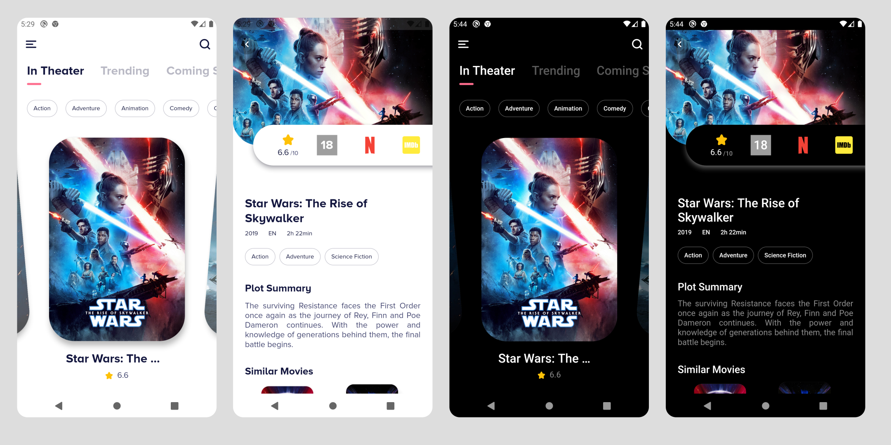

# Flutter Movies

## Table of Contents

- [About](#about)
- [Demo](#demo)
- [Dependencies](#dependencies)
- [Getting Started](#getting_started)
- [Contributing](#contributing)
- [Credits](#credits)

## About

A movie showcase app powered by TMDB API. The main purpose of this project is to learn Flutter and apply best practices to it. While the app is functional, it should only be used as a reference project.

## Demo

## Dependencies

- State Managment: [Bloc](https://pub.dev/packages/bloc)
- Networking: [Chopper](https://pub.dev/packages/chopper)
- Routing: [Auto Route](https://pub.dev/packages/auto_route)
- Dependency Injection: [Injectable](https://pub.dev/packages/injectable)
- Data Classes: [Freezed](https://pub.dev/packages/freezed)

## Getting Started

The project uses [TMDB](https://developers.themoviedb.org) API, you will need to get your own key and store it as an environment variable.

## Contributing

PRs and Issues are always welcomed.

## Credits

Design Inspiration: [Movie App Concept by simantOo](https://www.uplabs.com/posts/movie-app-73d2113c-082b-465f-9f5d-9bd3acf176ec)
